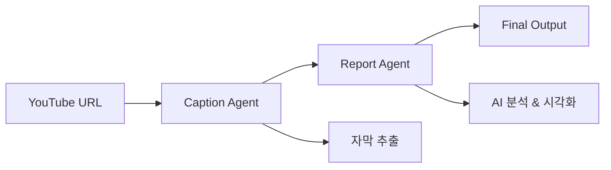

# 🎬 YouTube Reporter

AI 기반 YouTube 영상 분석 및 시각화 도구 - **MVC 아키텍처 + LangGraph 에이전트**

## 🏗️ 아키텍처

```
📱 React Frontend → 🌐 FastAPI (Controller) → 🧠 Service Layer → 🤖 LangGraph Agents
```

### 🔥 주요 특징

- **MVC 구조**: 깔끔한 코드 분리와 유지보수성
- **LangGraph 에이전트**: 자막 추출 → AI 분석 → 시각화 생성 워크플로우
- **실시간 처리**: 비동기 작업 및 상태 추적
- **시각화**: 차트, 마인드맵, 텍스트 섹션 자동 생성

## 📁 프로젝트 구조

```
youtube-reporter/
├── run.py                      # 🚀 메인 실행 파일
├── requirements.txt
├── .env.example
│
├── app/                        # 백엔드 (MVC 구조)
│   ├── controllers/            # 🎮 API 엔드포인트
│   │   └── youtube_controller.py
│   ├── models/                 # 📊 데이터 모델
│   │   ├── request_models.py
│   │   └── response_models.py
│   ├── services/               # 💼 비즈니스 로직
│   │   └── youtube_service.py
│   ├── agents/                 # 🤖 LangGraph 에이전트
│   │   ├── caption_agent.py    # 자막 추출
│   │   ├── report_agent.py     # AI 분석
│   │   └── graph_workflow.py   # LangGraph 워크플로우
│   ├── utils/                  # 🛠️ 유틸리티
│   │   ├── config.py
│   │   └── logger.py
│   └── main.py                 # FastAPI 앱
│
└── frontend/                   # React 프론트엔드
    ├── src/
    │   ├── App.jsx
    │   ├── App.css
    │   └── components/
    │       ├── VideoInput.jsx
    │       ├── StatusDisplay.jsx
    │       └── ResultViewer.jsx
    └── package.json
```

## 🚀 빠른 시작

### 1. 환경 설정

```bash
# 프로젝트 클론
git clone <repository-url>
cd youtube-reporter

# Python 가상환경
python -m venv venv
source venv/bin/activate  # Linux/Mac
# venv\Scripts\activate    # Windows

# 백엔드 의존성 설치
pip install -r requirements.txt

# 프론트엔드 설치
cd frontend
npm install
cd ..
```

### 2. 환경 변수 설정

```bash
cp .env.example .env
```

`.env` 파일 편집:
```bash
# 필수 설정
VIDCAP_API_KEY=your_vidcap_api_key_here
AWS_REGION=us-west-2
AWS_BEDROCK_MODEL_ID=anthropic.claude-3-5-sonnet-20241022-v2:0

# AWS 인증 (AWS CLI 또는 환경변수)
# AWS_ACCESS_KEY_ID=your_access_key
# AWS_SECRET_ACCESS_KEY=your_secret_key

# 선택적
LOG_LEVEL=INFO
```

### 3. 실행

```bash
# 백엔드 서버 (터미널 1)
python run.py

# 프론트엔드 서버 (터미널 2)
cd frontend
npm start
```

- 🌐 웹 인터페이스: http://localhost:3000
- 📖 API 문서: http://localhost:8000/docs

## 🔧 사용법

1. **YouTube URL 입력**: 분석할 영상 URL 입력
2. **분석 시작**: "🔍 분석 시작" 버튼 클릭
3. **실시간 상태 확인**: 자막 추출 → AI 분석 진행 상황 확인
4. **결과 확인**: 차트, 마인드맵, 텍스트 섹션으로 구성된 보고서 확인

## 🤖 LangGraph 워크플로우



### 에이전트 역할

- **Caption Agent**: VidCap API를 통한 YouTube 자막 추출
- **Report Agent**: Claude AI를 이용한 보고서 생성 및 시각화 데이터 생성

## 📊 생성되는 시각화

- **📈 차트**: 막대그래프, 선그래프, 파이차트
- **🧠 마인드맵**: 핵심 개념과 관계 시각화
- **📝 텍스트 섹션**: 구조화된 요약 및 설명

## 🔍 API 엔드포인트

| 메서드 | 엔드포인트 | 설명 |
|--------|------------|------|
| `POST` | `/api/v1/process` | 영상 처리 시작 |
| `GET` | `/api/v1/jobs/{job_id}/status` | 작업 상태 조회 |
| `GET` | `/api/v1/jobs/{job_id}/result` | 결과 조회 |
| `GET` | `/api/v1/jobs` | 모든 작업 목록 |
| `GET` | `/docs` | API 문서 |

## 🛠️ 개발 특징

### MVC 아키텍처
- **Controllers**: API 엔드포인트 및 요청 처리
- **Models**: 데이터 구조 및 검증
- **Services**: 비즈니스 로직 및 LangGraph 연동

### LangGraph 통합
- **상태 관리**: TypedDict 기반 그래프 상태
- **에이전트 체인**: 자막 추출 → AI 분석 → 결과 생성
- **오류 처리**: 각 단계별 안전한 오류 처리

### 비동기 처리
- **Background Tasks**: FastAPI 백그라운드 작업
- **실시간 상태**: 폴링 기반 진행 상황 업데이트
- **메모리 저장**: 단순한 인메모리 작업 큐

## 🔧 문제 해결

### 환경 변수 확인
```bash
python -c "from app.utils import Config; Config.validate()"
```

### AWS 설정 확인
```bash
aws configure list
aws sts get-caller-identity
```

### 개발 모드 실행
```bash
# 백엔드 개발 모드 (자동 재시작)
uvicorn app.main:create_app --factory --reload --port 8000

# 프론트엔드 개발 모드
cd frontend && npm start
```

## 📈 확장 가능성

- **데이터베이스**: 인메모리 저장소 → PostgreSQL/MongoDB
- **큐 시스템**: 메모리 큐 → Redis/Celery
- **에이전트 추가**: 새로운 LangGraph 에이전트 노드 추가
- **시각화 확장**: 더 많은 차트 타입 및 인터랙티브 요소
