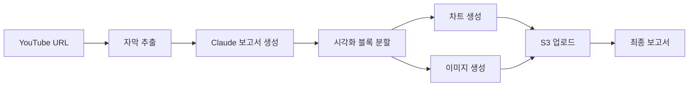

# 🎬 YouTube Reporter

YouTube 영상을 자동으로 분석하여 시각적 보고서를 생성하는 AI 파이프라인입니다.


## 📋 주요 기능

- **🎥 YouTube 자막 추출**: VidCap API를 통한 자동 자막 추출
- **📄 보고서 생성**: Claude를 이용한 구조화된 보고서 작성  
- **📊 자동 시각화**: 데이터 기반 차트, 그래프 자동 생성
- **🖼️ 이미지 생성**: DALL-E를 통한 컨셉 이미지 생성
- **☁️ 클라우드 저장**: S3를 통한 자동 이미지 저장 및 서빙
- **🌐 웹 인터페이스**: React 기반 사용자 친화적 UI
- **🔄 실시간 상태**: 비동기 처리 및 실시간 진행 상황 확인
- **🛡️ 견고한 에러 처리**: 포괄적인 에러 핸들링 및 로깅

## 🏗️ 아키텍처



### 프로젝트 구조

```
youtube-reporter/
├── app/                          # 백엔드 애플리케이션
│   ├── api/                      # FastAPI 웹 서버
│   │   └── main.py               # API 엔드포인트
│   ├── core/                     # 핵심 비즈니스 로직
│   │   ├── agents/               # AI 에이전트들
│   │   │   ├── youtube.py        # YouTube 자막 추출
│   │   │   ├── report_agent.py   # 보고서 생성
│   │   │   └── visual_split.py   # 시각화 블록 분할
│   │   ├── tools/                # 도구들
│   │   │   ├── code_exec.py      # 코드 실행 및 차트 생성
│   │   │   ├── s3.py             # S3 업로드
│   │   │   └── visual_gen.py     # 시각화 자산 생성
│   │   └── workflow/             # 워크플로우 관리
│   │       └── fsm.py            # LangGraph 기반 FSM
│   ├── config/                   # 설정 관리
│   │   └── settings.py           # 환경 변수 기반 설정
│   ├── utils/                    # 유틸리티
│   │   ├── env_validator.py      # 환경 변수 검증
│   │   ├── error_handler.py      # 에러 처리
│   │   ├── exceptions.py         # 커스텀 예외
│   │   ├── llm_factory.py        # LLM 팩토리
│   │   ├── logger.py             # 로깅 시스템
│   │   └── merge.py              # 결과 병합
│   └── main.py                   # CLI 실행 파일
├── frontend/                     # React 프론트엔드
│   ├── public/                   # 정적 파일
│   ├── src/                      # React 소스 코드
│   │   ├── App.jsx               # 메인 컴포넌트
│   │   ├── App.css               # 스타일링
│   │   └── index.js              # 엔트리 포인트
│   └── package.json              # 프론트엔드 의존성
├── .env.example                  # 환경 변수 템플릿
├── requirements.txt              # Python 의존성
└── README.md                     # 프로젝트 문서
```

## 🚀 빠른 시작

### 1. 환경 설정

```bash
# 저장소 클론
git clone <repository-url>
cd youtube-reporter

# Python 가상환경 생성 및 활성화
python -m venv venv
source venv/bin/activate  # Linux/Mac
# 또는
venv\Scripts\activate     # Windows

# 백엔드 의존성 설치
pip install -r requirements.txt

# 프론트엔드 의존성 설치
cd frontend
npm install
cd ..
```

### 2. 환경 변수 설정

`.env.example`을 복사하여 `.env` 파일을 생성하고 실제 값으로 변경:

```bash
cp .env.example .env
```

필수 환경 변수:
```bash
# VidCap API (YouTube 자막 추출용)
VIDCAP_API_KEY=your_vidcap_api_key_here

# OpenAI API (DALL-E 이미지 생성용)  
OPENAI_API_KEY=your_openai_api_key_here

# AWS 설정
AWS_REGION=us-west-2
S3_BUCKET_NAME=your-s3-bucket-name
AWS_BEDROCK_MODEL_ID=anthropic.claude-3-5-sonnet-20241022-v2:0

# AWS 자격증명 (AWS CLI 설정 또는 환경변수)
# AWS_ACCESS_KEY_ID=your_access_key
# AWS_SECRET_ACCESS_KEY=your_secret_key
```

### 3. AWS 설정

```bash
# AWS CLI 설정 (권장)
aws configure

# 또는 환경 변수로 설정
export AWS_ACCESS_KEY_ID=your_access_key
export AWS_SECRET_ACCESS_KEY=your_secret_key
```

### 4. 실행

#### CLI 모드
```bash
cd app
python main.py
```

#### 웹 서버 모드
```bash
# 백엔드 서버 실행 (터미널 1)
cd app/api
python main.py

# 프론트엔드 개발 서버 실행 (터미널 2)
cd frontend
npm start
```

웹 인터페이스: http://localhost:3000
API 문서: http://localhost:8000/docs

## 🔧 설정 옵션

### 필수 환경 변수

| 변수명 | 설명 | 예시 |
|--------|------|------|
| `VIDCAP_API_KEY` | VidCap API 키 | `your_api_key` |
| `OPENAI_API_KEY` | OpenAI API 키 | `sk-proj-...` |
| `AWS_REGION` | AWS 리전 | `us-west-2` |
| `S3_BUCKET_NAME` | S3 버킷 이름 | `my-youtube-reporter-bucket` |
| `AWS_BEDROCK_MODEL_ID` | Bedrock 모델 ID | `anthropic.claude-3-5-sonnet-20241022-v2:0` |

### 선택적 환경 변수

| 변수명 | 기본값 | 설명 |
|--------|--------|------|
| `LOG_LEVEL` | `INFO` | 로그 레벨 (DEBUG, INFO, WARNING, ERROR) |
| `VIDCAP_API_URL` | `https://vidcap.xyz/api/v1/youtube/caption` | VidCap API 엔드포인트 |
| `LLM_TEMPERATURE` | `0.7` | LLM 온도 설정 (0.0-2.0) |
| `LLM_MAX_TOKENS` | `4096` | 최대 토큰 수 |
| `DALLE_MODEL` | `dall-e-3` | DALL-E 모델 |
| `DALLE_IMAGE_SIZE` | `1024x1024` | 이미지 크기 |

### LangSmith 추적 (선택사항)

```bash
LANGCHAIN_API_KEY=your_langsmith_key
LANGCHAIN_TRACING_V2=true
LANGCHAIN_PROJECT=youtube-reporter
LANGCHAIN_ENDPOINT=https://api.smith.langchain.com
```

## 📊 사용 예시

### CLI 사용법
```bash
cd app
python main.py

# YouTube URL 입력
URL: https://www.youtube.com/watch?v=example123
```

### 웹 인터페이스 사용법
1. 브라우저에서 http://localhost:3000 접속
2. YouTube URL 입력
3. "분석 시작" 버튼 클릭
4. 실시간으로 처리 상태 확인
5. 완료 후 결과 확인

### API 사용법
```bash
# 작업 시작
curl -X POST "http://localhost:8000/api/v1/process" \
     -H "Content-Type: application/json" \
     -d '{"youtube_url": "https://www.youtube.com/watch?v=example"}'

# 상태 확인
curl "http://localhost:8000/api/v1/jobs/{job_id}/status"

# 결과 가져오기
curl "http://localhost:8000/api/v1/jobs/{job_id}/result"
```

### 출력 형식
```json
{
  "format": "json",
  "sections": [
    {
      "type": "paragraph",
      "content": "영상 요약 내용..."
    },
    {
      "type": "chart",
      "src": "https://your-bucket.s3.region.amazonaws.com/chart.png"
    },
    {
      "type": "image", 
      "src": "https://your-bucket.s3.region.amazonaws.com/concept.png"
    }
  ]
}
```

## 🛠️ 개발

### 코드 스타일
```bash
# 포맷팅
black app/

# 린팅  
flake8 app/
```

### 테스트
```bash
pytest
```

### 환경 검증
```bash
cd app
python -c "from utils.env_validator import check_environment_comprehensive; check_environment_comprehensive()"
```

### S3 접근 테스트
```bash
cd app
python -c "from core.tools.s3 import test_s3_access; test_s3_access()"
```

## 🔍 모니터링 및 디버깅

### 로그 레벨 설정
```bash
LOG_LEVEL=DEBUG  # 상세한 디버그 정보
LOG_LEVEL=INFO   # 일반 정보 (기본값)
LOG_LEVEL=WARNING # 경고만
LOG_LEVEL=ERROR  # 에러만
```

### 실시간 로그 확인
```bash
# CLI 실행시 자동으로 콘솔에 출력
# 웹 서버 실행시 uvicorn 로그와 함께 출력
```

### LangSmith 추적 활성화
LangChain 작업 흐름을 시각적으로 추적하려면:
```bash
LANGCHAIN_TRACING_V2=true
LANGCHAIN_API_KEY=your_langsmith_key
```

## ⚠️ 제한사항 및 주의사항

### 기술적 제한
- **API 의존성**: 외부 API (VidCap, OpenAI, AWS)에 의존
- **언어 지원**: 현재 한국어 자막만 완전 지원
- **영상 길이**: 매우 긴 영상(2시간+)의 경우 처리 시간이 오래 걸릴 수 있음
- **동시 처리**: 현재 메모리 기반 작업 큐 (Redis 권장)

### 비용 관련
- **OpenAI API**: DALL-E 이미지 생성 비용
- **AWS Bedrock**: Claude 모델 사용 비용  
- **AWS S3**: 스토리지 및 데이터 전송 비용
- **VidCap API**: 자막 추출 서비스 비용

### 보안 주의사항
- **환경 변수**: API 키를 `.env` 파일에 저장하고 Git에 커밋하지 않기
- **S3 권한**: 최소 권한 원칙에 따라 IAM 정책 설정
- **CORS**: 프로덕션에서는 적절한 CORS 정책 설정

## 🤝 기여하기

1. Fork the repository
2. Create a feature branch (`git checkout -b feature/amazing-feature`)
3. Commit your changes (`git commit -m 'Add amazing feature'`)
4. Push to the branch (`git push origin feature/amazing-feature`)
5. Open a Pull Request

### 개발 가이드라인
- Python 코드는 Black 포맷터 사용
- 모든 함수에 docstring 작성
- 새로운 기능에는 테스트 코드 추가
- 에러 처리 및 로깅 가이드라인 준수

## 🆘 문제 해결

### 일반적인 문제들

#### 환경 변수 오류
```bash
# 환경 변수 확인
python -c "import os; print('VIDCAP_API_KEY:', os.getenv('VIDCAP_API_KEY', 'Not set'))"

# 환경 검증 실행
cd app && python -c "from utils.env_validator import check_environment_comprehensive; check_environment_comprehensive()"
```

#### AWS 권한 오류
```bash
# AWS 설정 확인
aws configure list
aws sts get-caller-identity

# S3 접근 테스트
cd app && python -c "from core.tools.s3 import test_s3_access; test_s3_access()"
```

필요한 IAM 권한:
```json
{
  "Version": "2012-10-17",
  "Statement": [
    {
      "Effect": "Allow",
      "Action": [
        "bedrock:InvokeModel"
      ],
      "Resource": "arn:aws:bedrock:*:*:model/*"
    },
    {
      "Effect": "Allow", 
      "Action": [
        "s3:PutObject",
        "s3:PutObjectAcl",
        "s3:GetObject",
        "s3:DeleteObject"
      ],
      "Resource": "arn:aws:s3:::your-bucket-name/*"
    },
    {
      "Effect": "Allow",
      "Action": [
        "s3:ListBucket"
      ],
      "Resource": "arn:aws:s3:::your-bucket-name"
    }
  ]
}
```

#### 의존성 오류
```bash
# 가상환경 재생성
rm -rf venv
python -m venv venv
source venv/bin/activate  # Linux/Mac
pip install --upgrade pip
pip install -r requirements.txt

# 프론트엔드 의존성 재설치
cd frontend
rm -rf node_modules package-lock.json
npm install
```

#### 포트 충돌
```bash
# 다른 포트로 실행
# 백엔드
uvicorn app.api.main:app --host 0.0.0.0 --port 8001

# 프론트엔드  
PORT=3001 npm start
```

### 로그 확인

#### 백엔드 로그
```bash
# CLI 모드
cd app && LOG_LEVEL=DEBUG python main.py

# API 서버 모드
cd app/api && LOG_LEVEL=DEBUG python main.py
```

#### 프론트엔드 로그
브라우저 개발자 도구의 Console 탭에서 확인

### 성능 최적화

#### 처리 속도 향상
- S3 리전을 가까운 곳으로 설정
- Bedrock 모델을 더 빠른 버전으로 변경
- 이미지 크기를 줄여서 DALL-E 처리 시간 단축

#### 메모리 사용량 최적화
- `LLM_MAX_TOKENS` 값 조정
- 대용량 영상의 경우 자막을 청크 단위로 처리

## 📄 라이선스

MIT License

## 🔗 관련 링크

- [FastAPI 문서](https://fastapi.tiangolo.com/)
- [LangChain 문서](https://python.langchain.com/)
- [AWS Bedrock 문서](https://docs.aws.amazon.com/bedrock/)
- [OpenAI API 문서](https://platform.openai.com/docs)
- [React 문서](https://reactjs.org/)

## 📈 버전 히스토리

- **v1.0.0**: 초기 릴리스
  - YouTube 자막 추출
  - Claude 기반 보고서 생성
  - 차트 및 이미지 생성
  - S3 자동 업로드
  - React 웹 인터페이스
  - FastAPI 백엔드

---

더 자세한 문제 해결은 [Issues](link-to-issues) 페이지를 참조하거나 새로운 이슈를 등록해 주세요.
