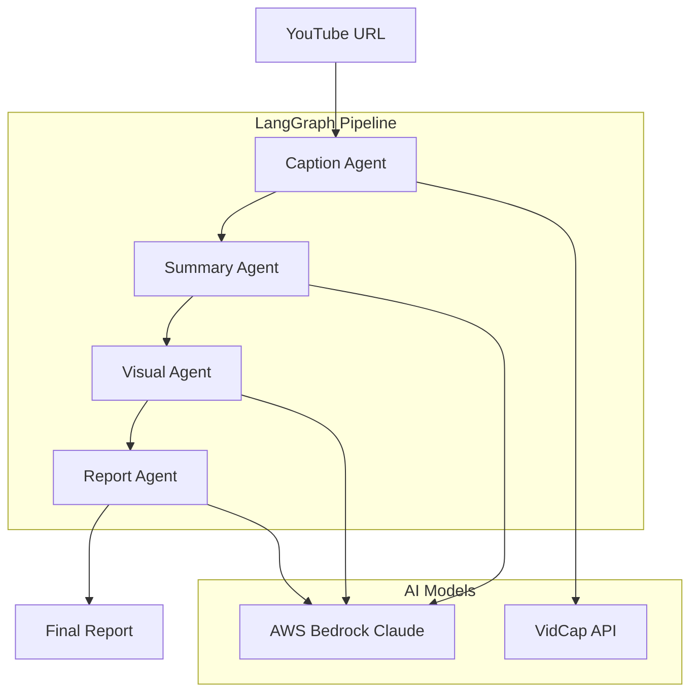

# 🎬 YouTube Reporter v2.0

> AI 기반 YouTube 영상 분석 및 스마트 시각화 도구

YouTube 영상을 보지 않고도 완전히 이해할 수 있는 포괄적 보고서와 최적화된 시각화를 자동으로 생성하는 고급 AI 파이프라인입니다.

## ✨ 주요 기능

### 🧠 포괄적 분석
- **완전성**: 영상의 모든 중요한 내용을 누락 없이 포함
- **구조화**: 논리적 흐름으로 읽기 쉽게 조직화  
- **맥락 제공**: 배경 정보와 전제 조건을 충분히 설명

### 🎨 스마트 시각화
- **컨텍스트 기반**: AI가 내용을 분석하여 시각화 기회 자동 탐지
- **최적화된 선택**: 내용에 가장 적합한 시각화 타입 자동 결정
- **다양한 형식**: Chart.js, Mermaid, HTML 테이블 등 지원

### 🚀 고성능 아키텍처
- **LangGraph 파이프라인**: 체계적인 AI 에이전트 워크플로우
- **FastAPI 백엔드**: 고성능 비동기 API 서버
- **React 프론트엔드**: 현대적이고 반응형 웹 인터페이스

## 🏗️ 아키텍처



## 📁 프로젝트 구조

```
youtube-reporter/
├── app/                          # 백엔드 애플리케이션
│   ├── main.py                   # FastAPI 애플리케이션
│   ├── api/                      # API 라우터
│   │   └── youtube.py
│   ├── services/                 # 비즈니스 로직
│   │   ├── youtube_service.py
│   │   └── langgraph_service.py
│   ├── agents/                   # AI 에이전트
│   │   ├── caption_agent.py
│   │   ├── summary_agent.py
│   │   ├── visual_agent.py
│   │   └── report_agent.py
│   ├── models/                   # 데이터 모델
│   │   ├── request.py
│   │   └── response.py
│   ├── core/                     # 핵심 설정
│   │   ├── config.py
│   │   └── dependencies.py
│   └── utils/                    # 유틸리티
│       ├── logger.py
│       └── helpers.py
├── frontend/                     # React 프론트엔드
├── requirements.txt              # Python 의존성
├── .env.example                 # 환경변수 템플릿
└── README.md
```

## 🚀 빠른 시작

### 1. 저장소 클론
```bash
git clone https://github.com/your-repo/youtube-reporter.git
cd youtube-reporter
```

### 2. 환경 설정
```bash
# 환경변수 설정
cp .env.example .env
# .env 파일을 편집하여 API 키 입력

# Python 가상환경 생성
python -m venv venv
source venv/bin/activate  # Linux/Mac
# 또는
venv\Scripts\activate     # Windows

# 의존성 설치
pip install -r requirements.txt
```

### 3. 서버 실행
```bash
# 개발 서버 시작
python -m app.main

# 또는 uvicorn으로 직접 실행
uvicorn app.main:app --reload --host 0.0.0.0 --port 8000
```

### 4. 웹 인터페이스 접속
- **애플리케이션**: http://localhost:8000
- **API 문서**: http://localhost:8000/docs
- **대화형 API**: http://localhost:8000/redoc

## ⚙️ 환경 변수 설정

### 필수 설정
```env
# VidCap API (YouTube 자막 추출)
VIDCAP_API_KEY=your_vidcap_api_key

# AWS Bedrock (Claude AI)
AWS_REGION=us-west-2
AWS_ACCESS_KEY_ID=your_aws_access_key
AWS_SECRET_ACCESS_KEY=your_aws_secret_key
BEDROCK_MODEL_ID=anthropic.claude-3-5-sonnet-20241022-v2:0
```

### 선택적 설정
```env
# OpenAI (DALL-E 이미지 생성)
OPENAI_API_KEY=your_openai_api_key

# AWS S3 (파일 저장)
S3_BUCKET_NAME=your-s3-bucket

# LangSmith (모니터링)
LANGCHAIN_TRACING_V2=true
LANGCHAIN_API_KEY=your_langsmith_api_key
```

## 📖 API 사용법

### 영상 처리 시작
```bash
curl -X POST "http://localhost:8000/api/v1/process" \
  -H "Content-Type: application/json" \
  -d '{
    "youtube_url": "https://www.youtube.com/watch?v=dQw4w9WgXcQ"
  }'
```

### 작업 상태 확인
```bash
curl "http://localhost:8000/api/v1/jobs/{job_id}/status"
```

### 결과 조회
```bash
curl "http://localhost:8000/api/v1/jobs/{job_id}/result"
```

## 🤖 AI 에이전트 구성

### 1. Caption Agent
- **역할**: YouTube 자막 추출
- **기술**: VidCap API
- **출력**: 한국어 자막 텍스트

### 2. Summary Agent  
- **역할**: 포괄적 요약 생성
- **기술**: AWS Bedrock Claude
- **출력**: 구조화된 분석 보고서

### 3. Visual Agent
- **역할**: 스마트 시각화 생성
- **기술**: 컨텍스트 분석 + 시각화 생성
- **출력**: Chart.js, Mermaid, HTML 시각화

### 4. Report Agent
- **역할**: 최종 리포트 통합
- **기술**: 섹션 병합 + 메타데이터 생성
- **출력**: 완성된 멀티미디어 리포트

## 🎯 시각화 타입

| 타입 | 라이브러리 | 용도 |
|------|------------|------|
| **차트** | Chart.js | 데이터 비교, 트렌드, 비율 |
| **다이어그램** | Mermaid | 프로세스, 플로우, 관계도 |  
| **테이블** | HTML | 정확한 데이터 비교 |
| **고급** | D3.js | 복잡한 데이터 시각화 |

## 🧪 테스트

```bash
# 단위 테스트 실행
pytest

# 커버리지 포함 테스트
pytest --cov=app

# API 테스트
pytest tests/test_api.py

# 통합 테스트
pytest tests/test_integration.py
```

## 🚀 배포

### Docker 배포
```bash
# Docker 이미지 빌드
docker build -t youtube-reporter .

# 컨테이너 실행
docker run -p 8000:8000 --env-file .env youtube-reporter
```

### AWS 배포
1. **ECS Fargate**: 컨테이너 기반 배포
2. **Lambda**: 서버리스 배포 (경량화 필요)
3. **EC2**: 전통적인 서버 배포

## 📊 모니터링

### LangSmith 추적
```env
LANGCHAIN_TRACING_V2=true
LANGCHAIN_API_KEY=your_key
LANGCHAIN_PROJECT=youtube-reporter
```

### 로그 수준 설정
```env
LOG_LEVEL=INFO  # DEBUG, INFO, WARNING, ERROR
```

### 헬스 체크
```bash
curl http://localhost:8000/health
```

## 🛠️ 개발 가이드

### 코드 스타일
```bash
# 코드 포맷팅
black app/
isort app/

# 린팅
flake8 app/
mypy app/
```

### 새 에이전트 추가
1. `app/agents/` 에 새 에이전트 클래스 생성
2. `Runnable` 인터페이스 구현
3. `LangGraphService` 에 노드 추가
4. 테스트 코드 작성

### 새 API 엔드포인트 추가
1. `app/models/` 에 요청/응답 모델 정의
2. `app/api/` 에 라우터 함수 추가
3. 서비스 로직을 `app/services/` 에 구현
4. API 문서 업데이트

## ❓ 문제 해결

### 자막 추출 실패
- YouTube 영상에 자막이 있는지 확인
- VidCap API 키 유효성 검증
- 네트워크 연결 상태 확인

### AWS Bedrock 오류
```bash
# AWS 자격 증명 확인
aws configure list

# Bedrock 모델 확인  
aws bedrock list-foundation-models --region us-west-2
```

### 메모리 부족
- 긴 영상은 자막을 청크 단위로 처리
- `MAX_CONCURRENT_JOBS` 환경변수로 동시 작업 수 제한

## 🤝 기여하기

1. **이슈 등록**: 버그 리포트나 기능 요청
2. **Pull Request**: 코드 개선이나 새 기능
3. **문서 개선**: README나 API 문서 업데이트
4. **테스트 추가**: 테스트 커버리지 향상

### 커밋 컨벤션
```
feat: 새로운 기능 추가
fix: 버그 수정
docs: 문서 수정
style: 코드 포맷팅
refactor: 코드 리팩토링
test: 테스트 추가/수정
chore: 빌드/패키지 관리
```

## 📜 버전 히스토리

### v2.0.0 (최신)
- 🏗️ FastAPI 아키텍처로 리팩토링
- 🤖 LangGraph 기반 AI 파이프라인 구현
- 🎨 스마트 시각화 시스템 추가
- 📊 향상된 모니터링 및 로깅

### v1.0.0
- 🚀 초기 버전 출시
- 📝 기본 자막 추출 및 요약 기능

## 📞 지원

- **이슈 트래커**: [GitHub Issues](https://github.com/your-repo/youtube-reporter/issues)
- **위키**: [GitHub Wiki](https://github.com/your-repo/youtube-reporter/wiki)
- **API 문서**: http://localhost:8000/docs

## 🙏 감사의 말

- **Anthropic**: Claude AI 모델 제공
- **LangChain**: 강력한 LLM 프레임워크
- **FastAPI**: 현대적인 웹 프레임워크  
- **Chart.js**: 아름다운 차트 라이브러리
- **Mermaid**: 다이어그램 생성 도구

---