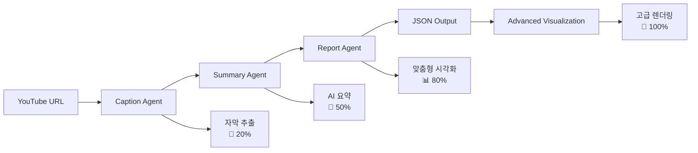

# 🎬 YouTube Reporter

AI 기반 YouTube 영상 분석 및 시각화 도구 - **LangGraph 에이전트 + 고급 시각화**

## 🏗️ 아키텍처

```
📱 React Frontend → 🌐 FastAPI Backend → 🤖 LangGraph Agents → 📊 구조화된 JSON → 🎨 고급 시각화
```

### 🔥 주요 특징

- **3단계 LangGraph 워크플로우**: 자막 추출 → AI 요약 → 시각화 데이터 생성
- **실시간 처리**: 비동기 작업 및 단계별 진행률 표시
- **고급 시각화**: 그라데이션, 애니메이션, 인터랙티브 차트
- **필수 시각화**: 내용에 맞는 최소 1개 이상의 시각화 보장
- **즉시 피드백**: 분석 시작 즉시 알림 및 상태 업데이트

## 📊 데이터 흐름

1. **자막 추출**: VidCap API → YouTube 자막 텍스트
2. **AI 요약**: Claude AI → 영상 핵심 내용 요약
3. **시각화 생성**: Claude AI → 내용 기반 맞춤형 시각화 데이터
4. **고급 렌더링**: React + Recharts + 커스텀 컴포넌트

## 📁 프로젝트 구조

```
youtube-reporter/
├── main.py                     # 🚀 통합 실행 파일 (FastAPI)
├── requirements.txt
├── .env.example
│
├── app/                        # LangGraph 에이전트
│   └── agents/                 # 🤖 3단계 워크플로우
│       ├── caption_agent.py    # 자막 추출
│       ├── summary_agent.py    # AI 요약 (NEW)
│       ├── report_agent.py     # 맞춤형 시각화 생성
│       └── graph_workflow.py   # LangGraph 워크플로우
│
└── frontend/                   # React 프론트엔드
    ├── src/
    │   ├── App.jsx              # 메인 앱 + 즉시 알림
    │   └── components/
    │       ├── VideoInput.jsx   # YouTube URL 입력
    │       ├── StatusDisplay.jsx # 실시간 진행률
    │       ├── ResultViewer.jsx  # 결과 표시
    │       └── AdvancedVisualization.jsx # 🎨 고급 시각화
    └── package.json
```

## 🚀 빠른 시작

### 1. 환경 설정

```bash
# 프로젝트 클론
git clone <repository-url>
cd youtube-reporter

# Python 가상환경
python -m venv venv
source venv/bin/activate  # Linux/Mac
# venv\Scripts\activate    # Windows

# 백엔드 의존성 설치
pip install -r requirements.txt

# 프론트엔드 설치
cd frontend
npm install
cd ..
```

### 2. 환경 변수 설정

```bash
cp .env.example .env
```

`.env` 파일 편집:

```bash
# 필수 설정 - VidCap API (YouTube 자막 추출)
VIDCAP_API_KEY=your_vidcap_api_key_here

# 필수 설정 - AWS Bedrock (Claude AI)
AWS_REGION=us-west-2
AWS_BEDROCK_MODEL_ID=anthropic.claude-3-5-sonnet-20241022-v2:0

# AWS 인증 (AWS CLI 또는 환경변수)
# AWS_ACCESS_KEY_ID=your_access_key
# AWS_SECRET_ACCESS_KEY=your_secret_key
```

### 3. 실행

```bash
# 백엔드 서버 (터미널 1)
python main.py

# 프론트엔드 서버 (터미널 2)
cd frontend
npm start
```

- 🌐 웹 인터페이스: http://localhost:3000
- 📖 API 문서: http://localhost:8000/docs

## 🎨 고급 시각화 기능

### 지원하는 시각화 타입

1. **📊 기본 데이터 차트**
   - 막대 차트 (Bar Chart) - 비교 데이터
   - 선 차트 (Line Chart) - 트렌드, 시간 변화
   - 파이 차트 (Pie Chart) - 비율, 구성 요소

2. **🧠 인터랙티브 마인드맵 (NEW)**
   - **D3.js Force-directed Graph**: 물리 시뮬레이션 기반
   - **실시간 편집**: 클릭→편집, 더블클릭→추가, 우클릭→삭제
   - **드래그 & 줌**: 자유로운 노드 조작
   - **동적 연결**: 부모-자식 관계 시각화

3. **🎨 고급 ApexCharts (NEW)**
   - **3D 산점도**: 3차원 데이터 시각화
   - **실시간 라인**: 애니메이션과 실시간 업데이트
   - **혼합 차트**: 막대+선 차트, 다중 Y축
   - **히트맵**: 데이터 밀도와 패턴 표현
   - **레이더 차트**: 다차원 데이터 비교
   - **트리맵**: 계층적 데이터 구조

4. **🔄 프로세스 시각화**
   - 프로세스 플로우 - 단계별 과정
   - 타임라인 - 시간순 이벤트

5. **📋 구조화 시각화**
   - 비교 테이블 - 제품/서비스 비교
   - 게이지 차트 - 진행률, 성과 지표

### 시각화 특징

- **🎨 아름다운 디자인**: 그라데이션, 그림자, 둥근 모서리
- **✨ 부드러운 애니메이션**: 페이드인, 스케일, 호버 효과
- **📱 반응형**: 모바일/태블릿 최적화
- **🎯 맞춤형 생성**: 영상 내용에 따른 적절한 시각화 선택
- **⚡ 성능 최적화**: Lazy Loading, 메모리 관리, 대용량 데이터 처리
- **🤖 AI 기반 추천**: 데이터 타입 분석 후 최적 시각화 자동 선택
- **🛡️ 에러 처리**: Error Boundary와 폴백 시스템
- **🎮 인터랙티브**: 드래그, 줌, 실시간 편집 지원

## 🤖 개선된 LangGraph 워크플로우



### 3단계 처리 과정

1. **Caption Agent**: VidCap API로 자막 추출
2. **Summary Agent**: Claude AI로 핵심 내용 요약 (NEW)
3. **Report Agent**: 요약 기반 맞춤형 시각화 데이터 생성

### 실시간 피드백

- **🚀 즉시 시작 알림**: "분석을 시작합니다..."
- **📝 20%**: 자막을 추출하고 있습니다...
- **🧠 50%**: 영상 내용을 요약하고 있습니다...
- **📊 80%**: 시각화 자료를 생성하고 있습니다...
- **🎉 100%**: 분석이 완료되었습니다!

## 📊 시각화 생성 전략

### 우선순위 시스템

1. **1순위**: 실제 수치 데이터 → 차트 (막대/선/파이)
2. **2순위**: 과정/단계 → 프로세스 플로우
3. **3순위**: 시간순 내용 → 타임라인
4. **4순위**: 비교 내용 → 비교 테이블
5. **5순위**: 개념 정리 → 마인드맵 (항상 가능)

### 필수 시각화 보장

- **최소 1개 보장**: 어떤 내용이든 최소 1개 시각화 생성
- **내용 기반**: 영상에서 언급된 실제 데이터 우선 사용
- **Fallback**: 데이터 부족 시 마인드맵으로 개념 구조화

## 🔧 사용법

1. **YouTube URL 입력**: 분석할 영상 URL 입력
2. **즉시 피드백**: "🚀 분석을 시작합니다..." 알림
3. **실시간 진행률**: 단계별 진행 상황 확인
4. **고급 시각화**: 아름다운 차트와 애니메이션으로 결과 확인

## 🎨 시각화 라이브러리

### 프론트엔드 스택

- **Recharts**: 반응형 차트 (막대, 선, 파이)
- **D3.js**: 인터랙티브 마인드맵, Force-directed Graph
- **ApexCharts**: 고급 차트 (3D, 실시간, 혼합, 히트맵, 레이더)
- **Plotly.js**: 3D 시각화, 과학적 차트
- **Framer Motion**: 부드러운 애니메이션
- **React Spring**: 스프링 기반 애니메이션
- **React.lazy**: 성능 최적화를 위한 코드 분할
- **커스텀 CSS**: 그라데이션, 호버 효과, 반응형 디자인

### 색상 팔레트

```css
/* 아름다운 그라데이션 색상 */
linear-gradient(135deg, #667eea 0%, #764ba2 100%)
linear-gradient(135deg, #f093fb 0%, #f5576c 100%)
linear-gradient(135deg, #4facfe 0%, #00f2fe 100%)
linear-gradient(135deg, #43e97b 0%, #38f9d7 100%)
```

## 🔍 API 엔드포인트

| 메서드 | 엔드포인트                     | 설명                    |
| ------ | ------------------------------ | ----------------------- |
| `POST` | `/api/v1/process`              | 영상 처리 시작          |
| `GET`  | `/api/v1/jobs/{job_id}/status` | 실시간 작업 상태 조회   |
| `GET`  | `/api/v1/jobs/{job_id}/result` | 시각화 결과 조회 (JSON) |
| `GET`  | `/api/v1/jobs`                 | 모든 작업 목록          |
| `GET`  | `/api/v1/`                     | API 상태 확인           |
| `GET`  | `/docs`                        | API 문서                |

## 💻 기술 스택

### 백엔드

- **FastAPI**: 고성능 웹 API
- **LangGraph**: AI 에이전트 워크플로우
- **LangChain**: LLM 추상화
- **AWS Bedrock**: Claude AI
- **VidCap API**: YouTube 자막 추출

### 프론트엔드

- **React 18**: 최신 React (Suspense, lazy loading)
- **D3.js v7**: 인터랙티브 마인드맵, 물리 시뮬레이션
- **ApexCharts v4**: 고급 차트 라이브러리
- **Recharts**: 반응형 기본 차트
- **Plotly.js**: 3D 및 과학적 시각화
- **Framer Motion**: 부드러운 애니메이션
- **CSS Grid/Flexbox**: 반응형 레이아웃
- **Error Boundaries**: 안정적인 에러 처리

## 🔧 문제 해결

### 의존성 설치 오류

```bash
# React 18 호환 라이브러리만 사용
cd frontend
npm install --legacy-peer-deps
```

### 환경 변수 확인

```bash
python -c "import os; print('VIDCAP_API_KEY:', bool(os.getenv('VIDCAP_API_KEY')))"
```

### AWS 설정 확인

```bash
aws configure list
aws bedrock list-foundation-models --region us-west-2
```

## 📈 최근 업데이트

### v2.0.0 - 🚀 마인드맵 & 고급 시각화 대폭 업그레이드

#### 🧠 D3.js 기반 인터랙티브 마인드맵
- **Force-directed Graph**: 물리 시뮬레이션 기반 자연스러운 레이아웃
- **실시간 편집**: 클릭→편집, 더블클릭→추가, 우클릭→삭제
- **드래그 & 줌**: 자유로운 탐색과 조작
- **동적 연결**: 노드 간 실시간 링크 생성

#### 🎨 ApexCharts & Plotly 고급 시각화
- **3D 차트**: 3D 산점도, 표면 차트, 홀로그램 스타일
- **실시간 차트**: 애니메이션과 실시간 데이터 업데이트
- **혼합 차트**: 막대+선 차트, 다중 Y축 지원
- **히트맵 & 레이더**: 복잡한 데이터 패턴 시각화
- **트리맵**: 계층적 데이터 표현

#### ⚡ 성능 최적화 & AI 기반 자동화
- **Lazy Loading**: 고급 컴포넌트 필요시에만 로드
- **Performance Mode**: 대용량 데이터 자동 감지 및 최적화
- **AI 시각화 추천**: 데이터 타입에 따른 최적 차트 자동 선택
- **Error Boundary**: 시각화 실패시 폴백 시스템
- **Memory Management**: 불필요한 렌더링 방지

#### 🎯 향상된 사용자 경험
- **마인드맵 편집기**: VisualizationEditor에서 마인드맵 노드 직접 편집
- **테마 시스템**: 다크모드, 프로페셔널, 네이처 테마
- **반응형 디자인**: 모든 디바이스에서 완벽한 시각화
- **실시간 피드백**: 로딩 상태와 에러 처리 개선

### v1.2.0 - 고급 시각화 및 UX 개선

- ✨ 고급 시각화: 그라데이션, 애니메이션, 호버 효과
- 🚀 즉시 피드백: 분석 시작 알림 및 실시간 진행률
- 🎯 필수 시각화: 내용에 맞는 최소 1개 시각화 보장
- 🤖 3단계 워크플로우: 자막 → 요약 → 시각화
- 📱 반응형 디자인: 모바일/태블릿 최적화

### v1.1.0 - 구조 단순화

- 🔧 단일 main.py 실행 파일
- 📊 동적 시각화 생성
- 🛠️ 의존성 충돌 해결

## 🔐 보안 고려사항

- API 키는 환경 변수로 관리
- CORS 설정으로 도메인 제한
- 입력 검증: YouTube URL 형식 검증
- 에러 처리: 민감한 정보 노출 방지