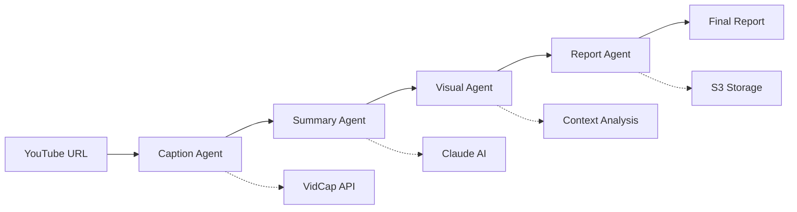

# 🎬 YouTube Reporter v2.0 - Smart Visualization Edition

AI 기반 YouTube 영상 분석 및 스마트 시각화 도구  
**LangGraph 에이전트 + 통합 백엔드 시스템**

[](https://fastapi.tiangolo.com)
[](https://github.com/langchain-ai/langgraph)
[](https://www.anthropic.com)
[](https://python.org)

## 🌟 주요 기능

### 🤖 AI 에이전트 워크플로우 (LangGraph 기반)
- **Caption Agent**: YouTube 자막 추출 및 전처리
- **Summary Agent**: 영상을 보지 않고도 완전히 이해할 수 있는 포괄적 요약 생성
- **Smart Visual Agent**: 컨텍스트 기반 시각화 자동 생성
- **Report Agent**: 텍스트와 시각화를 통합한 최종 리포트 생성

### 📊 스마트 시각화
- **Chart.js**: 막대, 선, 파이, 레이더, 산점도 차트
- **vis.js**: 네트워크 다이어그램, 관계도, 계층 구조
- **React Flow**: 프로세스 플로우차트, 워크플로우 다이어그램
- **D3.js**: 타임라인, 트리맵, 힘 기반 다이어그램
- **동적 테이블**: 정렬 가능한 비교표

### 🎯 컨텍스트 기반 분석
- 내용의 맥락을 파악하여 최적의 시각화 자동 선택
- 복잡한 개념, 프로세스, 비교 데이터를 시각적으로 표현
- 사용자 이해도를 높이는 인사이트 제공

### 🔧 통합 백엔드 시스템
- **AWS S3**: 보고서 자동 저장 및 관리
- **AWS Polly**: 음성 요약 생성
- **AWS Cognito**: 사용자 인증 및 권한 관리
- **PostgreSQL + Redis**: 데이터 저장 및 캐싱
- **실시간 스트리밍**: 오디오 파일 재생

## 🏗️ 시스템 아키텍처

```
┌─────────────────┐    ┌──────────────────┐    ┌─────────────────┐
│   프론트엔드      │    │   LangGraph       │    │   AWS 서비스     │
│   (React)       │◄──►│   에이전트 FSM     │◄──►│   (Bedrock,     │
│                 │    │                  │    │    S3, Polly)   │
└─────────────────┘    └──────────────────┘    └─────────────────┘
         │                        │                        │
         ▼                        ▼                        ▼
┌─────────────────┐    ┌──────────────────┐    ┌─────────────────┐
│   FastAPI       │    │   상태 관리       │    │   데이터베이스    │
│   REST API      │◄──►│   (Redis)        │◄──►│   (PostgreSQL)  │
└─────────────────┘    └──────────────────┘    └─────────────────┘
```

## 🚀 설치 및 실행

### 1. 사전 요구사항
- Python 3.9 이상
- Node.js 16 이상 (프론트엔드용)
- PostgreSQL
- Redis
- AWS 계정 (Bedrock, S3, Polly 액세스)

### 2. 저장소 클론 및 환경 설정
```bash
# 저장소 클론
git clone <repository-url>
cd youtube-reporter

# Python 가상환경 생성
python -m venv venv
source venv/bin/activate  # Linux/Mac
venv\Scripts\activate     # Windows

# 의존성 설치
pip install --upgrade pip
pip install -r requirements.txt
```

### 3. 환경 변수 설정
```bash
# .env.example을 .env로 복사
cp .env.example .env

# .env 파일 편집하여 실제 값 입력
nano .env  # 또는 원하는 에디터 사용
```

**필수 환경 변수:**
```env
VIDCAP_API_KEY=your_vidcap_api_key
AWS_REGION=ap-northeast-2
AWS_ACCESS_KEY_ID=your_aws_access_key
AWS_SECRET_ACCESS_KEY=your_aws_secret_access_key
S3_BUCKET_NAME=your-s3-bucket-name
```

### 4. 데이터베이스 설정
```bash
# PostgreSQL 테이블 생성
python create_tables.py

# Redis 서버 실행 (별도 터미널)
redis-server
```

### 5. 서버 실행
```bash
# 백엔드 서버 실행
python main.py

# 프론트엔드 실행 (새 터미널)
cd frontend
npm install
npm start
```

## 📡 API 엔드포인트

### 🎬 YouTube Reporter (LangGraph 에이전트)
| 메서드 | 엔드포인트 | 설명 |
|--------|------------|------|
| `POST` | `/youtube-reporter/analyze` | 영상 분석 시작 |
| `GET` | `/youtube-reporter/jobs/{job_id}/status` | 작업 상태 조회 |
| `GET` | `/youtube-reporter/jobs/{job_id}/result` | 분석 결과 조회 |
| `GET` | `/youtube-reporter/jobs` | 작업 목록 조회 |
| `DELETE` | `/youtube-reporter/jobs/{job_id}` | 작업 삭제 |

### 👤 사용자 관리
| 메서드 | 엔드포인트 | 설명 |
|--------|------------|------|
| `POST` | `/auth/signup` | 회원가입 |
| `POST` | `/auth/login` | 로그인 |
| `GET` | `/user/jobs` | 내 작업 목록 |
| `GET` | `/user/reports` | 내 보고서 목록 |

### 🔊 오디오 서비스
| 메서드 | 엔드포인트 | 설명 |
|--------|------------|------|
| `POST` | `/audio/generate` | 텍스트 음성 변환 |
| `GET` | `/audio/stream/{audio_id}` | 오디오 스트리밍 |

### 📊 보고서 관리
| 메서드 | 엔드포인트 | 설명 |
|--------|------------|------|
| `GET` | `/reports/list` | 보고서 목록 |
| `GET` | `/reports/{report_id}` | 보고서 다운로드 |
| `GET` | `/s3/list` | S3 객체 목록 |

## 🔄 LangGraph 워크플로우



### 워크플로우 단계
1. **자막 추출**: VidCap API를 통한 YouTube 자막 획득
2. **포괄적 요약**: Claude AI가 영상 내용을 완전 분석
3. **시각화 분석**: 컨텍스트 기반 시각화 기회 탐지
4. **스마트 시각화**: 최적의 차트/다이어그램 자동 생성
5. **리포트 통합**: 텍스트와 시각화의 완벽한 통합

## 📁 프로젝트 구조

```
youtube-reporter/
├── app/
│   ├── agents/              # LangGraph 에이전트들
│   │   ├── caption_agent.py
│   │   ├── summary_agent.py
│   │   ├── visual_agent.py
│   │   ├── report_agent.py
│   │   └── graph_workflow.py
│   ├── core/                # 핵심 설정
│   │   ├── config.py
│   │   ├── auth.py
│   │   └── database.py
│   ├── models/              # 데이터 모델
│   │   ├── analysis.py
│   │   ├── youtube_reporter.py
│   │   └── database_models.py
│   ├── routers/             # API 라우터
│   │   ├── youtube_reporter.py
│   │   ├── auth.py
│   │   ├── user_analysis.py
│   │   └── audio.py
│   ├── services/            # 비즈니스 로직
│   │   ├── youtube_reporter_service.py
│   │   ├── state_manager.py
│   │   ├── s3_service.py
│   │   └── audio_service.py
│   └── utils/               # 유틸리티
│       ├── logger.py
│       └── helpers.py
├── frontend/                # React 프론트엔드
│   ├── src/
│   │   ├── components/
│   │   │   ├── VideoInput.jsx
│   │   │   ├── StatusDisplay.jsx
│   │   │   ├── ResultViewer.jsx
│   │   │   └── SmartVisualization.jsx
│   │   └── App.jsx
│   └── package.json
├── requirements.txt         # Python 의존성
├── .env.example            # 환경 변수 예제
├── create_tables.py        # DB 테이블 생성
└── main.py                 # 메인 실행 파일
```

## 🎯 사용법

### 1. 기본 사용 (웹 인터페이스)
1. `http://localhost:3000` 접속
2. YouTube URL 입력
3. AI 자동 분석 대기 (1-3분)
4. 포괄적 리포트 + 스마트 시각화 확인

### 2. API 사용 (프로그래밍)
```python
import requests

# 분석 시작
response = requests.post('http://localhost:8000/youtube-reporter/analyze', 
    json={'youtube_url': 'https://www.youtube.com/watch?v=VIDEO_ID'})
job_id = response.json()['job_id']

# 결과 확인
result = requests.get(f'http://localhost:8000/youtube-reporter/jobs/{job_id}/result')
print(result.json())
```

## 🛠️ 기술 스택

### 백엔드
- **FastAPI**: 고성능 Python 웹 프레임워크
- **LangGraph**: AI 에이전트 워크플로우 관리
- **LangChain**: AI 체인 및 프롬프트 관리
- **Claude AI (AWS Bedrock)**: 텍스트 분석 및 생성
- **PostgreSQL**: 관계형 데이터베이스
- **Redis**: 상태 관리 및 캐싱

### 프론트엔드
- **React**: UI 라이브러리
- **Chart.js**: 차트 시각화
- **vis.js**: 네트워크 다이어그램
- **React Flow**: 플로우차트
- **D3.js**: 고급 시각화

### AI & 클라우드
- **AWS Bedrock**: Claude AI 모델 호스팅
- **AWS S3**: 파일 저장 및 관리
- **AWS Polly**: 음성 합성
- **VidCap API**: YouTube 자막 추출

## 📊 시각화 타입

| 타입 | 라이브러리 | 용도 |
|------|------------|------|
| 막대/선/파이 차트 | Chart.js | 데이터 비교, 추세 분석 |
| 네트워크 다이어그램 | vis.js | 관계도, 연결망 |
| 플로우차트 | React Flow | 프로세스, 워크플로우 |
| 타임라인 | D3.js | 시간 순서, 역사적 사건 |
| 테이블 | HTML/CSS | 정확한 수치 비교 |

## 🔧 개발 가이드

### 새로운 에이전트 추가
```python
# app/agents/your_agent.py
from langchain_core.runnables import Runnable

class YourAgent(Runnable):
    def invoke(self, state: dict, config=None):
        # 에이전트 로직 구현
        return {**state, "new_field": "value"}
```

### 새로운 시각화 타입 추가
```python
# app/agents/visual_agent.py
def _generate_smart_visualization(self, context, opportunity):
    # 새로운 시각화 로직 추가
    if opportunity.get('suggested_type') == 'your_viz_type':
        return self._create_your_visualization(context, opportunity)
```

## 🚨 주의사항

1. **API 키 보안**: 실제 API 키는 절대 Git에 커밋하지 마세요
2. **AWS 비용**: Bedrock과 S3 사용 시 비용이 발생할 수 있습니다
3. **자막 제한**: 영상에 자막이 없으면 분석이 제한됩니다
4. **처리 시간**: 복잡한 영상은 분석에 3-5분 소요될 수 있습니다

## 🐛 문제 해결

### 자주 발생하는 오류들

**1. LangGraph 버전 호환성**
```bash
pip install --upgrade langgraph langchain-core
```

**2. AWS 자격증명 오류**
```bash
aws configure  # AWS CLI 설정
# 또는 .env 파일에서 AWS_ACCESS_KEY_ID, AWS_SECRET_ACCESS_KEY 확인
```

**3. Redis 연결 오류**
```bash
redis-server  # Redis 서버 실행
```

**4. PostgreSQL 연결 오류**
```bash
# 데이터베이스 생성 및 테이블 생성
createdb backend_final
python create_tables.py
```

## 📈 성능 최적화

- **Redis 캐싱**: 분석 결과 캐싱으로 응답 속도 향상
- **비동기 처리**: FastAPI + asyncio로 동시 요청 처리
- **S3 스트리밍**: 대용량 보고서 효율적 전송
- **프로그레스 추적**: 실시간 작업 진행률 표시