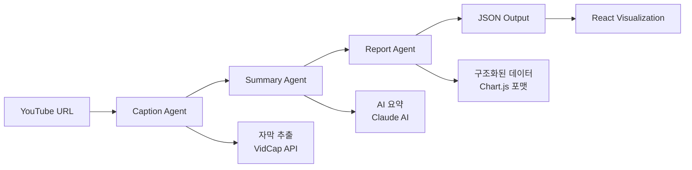

# 🎬 YouTube Reporter

AI 기반 YouTube 영상 분석 및 시각화 도구 - **LangGraph 에이전트 + 구조화된 데이터 시각화**

## 🏗️ 아키텍처

```
📱 React Frontend → 🌐 FastAPI Backend → 🤖 LangGraph Agents → 📊 구조화된 JSON → 🎨 시각화
```

### 🔥 주요 특징

- **LangGraph 워크플로우**: 자막 추출 → 요약 → AI 분석 → 구조화된 데이터 생성
- **실시간 처리**: 비동기 작업 및 상태 추적 (폴링 방식)
- **동적 시각화**: 백엔드 JSON 데이터를 Chart.js + 커스텀 컴포넌트로 렌더링
- **메모리 기반**: 간단한 인메모리 작업 큐 (확장 가능)

## 📊 데이터 흐름

1. **자막 추출**: VidCap API → YouTube 자막 텍스트
2. **AI 요약**: Claude AI → 영상 내용 요약
3. **구조화 생성**: Claude AI → JSON 형태의 섹션 배열 (차트, 마인드맵, 텍스트)
4. **시각화**: React → Chart.js/커스텀 컴포넌트로 렌더링

## 📁 프로젝트 구조

```
youtube-reporter/
├── main.py                     # 🚀 간단한 실행 파일 (FastAPI 단일 파일)
├── requirements.txt
├── .env.example
│
├── app/                        # LangGraph 에이전트 (백엔드 로직)
│   ├── agents/                 # 🤖 LangGraph 워크플로우
│   │   ├── caption_agent.py    # 자막 추출 에이전트
│   │   ├── summary_agent.py    # AI 요약 에이전트
│   │   ├── report_agent.py     # 구조화된 데이터 생성 에이전트
│   │   └── graph_workflow.py   # LangGraph 워크플로우 정의
│   └── utils/
│       ├── config.py
│       └── logger.py
│
└── frontend/                   # React 프론트엔드 (시각화)
    ├── src/
    │   ├── App.jsx              # 메인 앱
    │   ├── App.css              # 전체 스타일
    │   └── components/
    │       ├── VideoInput.jsx   # YouTube URL 입력
    │       ├── StatusDisplay.jsx # 처리 상태 표시
    │       └── ResultViewer.jsx  # 결과 시각화 (차트, 마인드맵)
    └── package.json
```

## 🚀 빠른 시작

### 1. 환경 설정

```bash
# 프로젝트 클론
git clone <repository-url>
cd youtube-reporter

# Python 가상환경
python -m venv venv
source venv/bin/activate  # Linux/Mac
# venv\Scripts\activate    # Windows

# 백엔드 의존성 설치
pip install -r requirements.txt

# 프론트엔드 설치
cd frontend
npm install
cd ..
```

### 2. 환경 변수 설정

```bash
cp .env.example .env
```

`.env` 파일 편집:

```bash
# 필수 설정 - VidCap API (YouTube 자막 추출)
VIDCAP_API_KEY=your_vidcap_api_key_here

# 필수 설정 - AWS Bedrock (Claude AI)
AWS_REGION=us-west-2
AWS_BEDROCK_MODEL_ID=anthropic.claude-3-5-sonnet-20241022-v2:0

# AWS 인증 (AWS CLI 또는 환경변수)
# AWS_ACCESS_KEY_ID=your_access_key
# AWS_SECRET_ACCESS_KEY=your_secret_key

# 선택적
LOG_LEVEL=INFO
```

### 3. 실행

```bash
# 백엔드 서버 (터미널 1)
python main.py

# 프론트엔드 서버 (터미널 2)
cd frontend
npm start
```

- 🌐 웹 인터페이스: http://localhost:3000
- 📖 API 문서: http://localhost:8000/docs

## 🔧 사용법

1. **YouTube URL 입력**: 분석할 영상 URL 입력
2. **분석 시작**: "🔍 분석 시작" 버튼 클릭
3. **실시간 상태 확인**: 자막 추출 → 요약 → 구조화 → 시각화 진행 상황 확인
4. **결과 확인**: 차트, 마인드맵, 텍스트 섹션으로 구성된 보고서 확인

## 🤖 LangGraph 워크플로우



### 에이전트 역할

- **Caption Agent**: VidCap API를 통한 YouTube 자막 추출
- **Summary Agent**: Claude AI를 이용한 영상 내용 요약
- **Report Agent**: 요약을 바탕으로 구조화된 시각화 데이터 생성 (JSON)

## 📊 생성되는 시각화 데이터

### 백엔드에서 생성되는 JSON 구조

```json
{
  "title": "영상 제목",
  "sections": [
    {
      "type": "heading",
      "title": "섹션 제목",
      "content": "설명 텍스트"
    },
    {
      "type": "bar_chart",
      "title": "차트 제목",
      "data": {
        "labels": ["라벨1", "라벨2"],
        "datasets": [{ "label": "데이터", "data": [10, 20] }]
      }
    },
    {
      "type": "mindmap",
      "title": "마인드맵",
      "data": {
        "center": "중심 개념",
        "branches": [{ "label": "브랜치", "children": ["항목1", "항목2"] }]
      }
    }
  ]
}
```

### 프론트엔드에서 렌더링되는 시각화

- **📈 차트**: Chart.js를 사용한 막대그래프, 선그래프, 파이차트
- **🧠 마인드맵**: 커스텀 CSS Grid 기반 인터랙티브 마인드맵
- **📝 텍스트 섹션**: 구조화된 요약 및 설명

## 🔍 API 엔드포인트

| 메서드 | 엔드포인트                     | 설명             |
| ------ | ------------------------------ | ---------------- |
| `POST` | `/api/v1/process`              | 영상 처리 시작   |
| `GET`  | `/api/v1/jobs/{job_id}/status` | 작업 상태 조회   |
| `GET`  | `/api/v1/jobs/{job_id}/result` | 결과 조회 (JSON) |
| `GET`  | `/api/v1/jobs`                 | 모든 작업 목록   |
| `GET`  | `/docs`                        | API 문서         |

## 🛠️ 개발 특징

### LangGraph 워크플로우

- **상태 관리**: TypedDict 기반 그래프 상태
- **에이전트 체인**: 자막 추출 → 요약 → 구조화된 데이터 생성
- **오류 처리**: 각 단계별 안전한 오류 처리

### 백엔드 ↔ 프론트엔드 분리

- **백엔드**: 구조화된 JSON 데이터 생성 (시각화 로직 없음)
- **프론트엔드**: JSON 데이터를 받아 Chart.js + 커스텀 컴포넌트로 시각화
- **확장성**: 새로운 시각화 타입 추가 시 양쪽 모두 확장 가능

### 비동기 처리

- **Background Tasks**: FastAPI 백그라운드 작업
- **실시간 상태**: 폴링 기반 진행 상황 업데이트 (3초 간격)
- **메모리 저장**: 단순한 인메모리 작업 큐

## 🔧 문제 해결

### 환경 변수 확인

```bash
python -c "from app.utils.config import Config; Config.validate()"
```

### AWS 설정 확인

```bash
aws configure list
aws sts get-caller-identity
```

### 개발 모드 실행

```bash
# 백엔드 개발 모드 (자동 재시작)
uvicorn main:app --reload --port 8000

# 프론트엔드 개발 모드
cd frontend && npm start
```

## 📈 확장 가능성

### 백엔드 확장

- **데이터베이스**: 인메모리 저장소 → PostgreSQL/MongoDB
- **큐 시스템**: 메모리 큐 → Redis/Celery
- **에이전트 추가**: 새로운 LangGraph 에이전트 노드 추가
- **새로운 데이터 타입**: JSON 스키마에 새로운 섹션 타입 추가

### 프론트엔드 확장

- **더 많은 차트**: D3.js, Plotly.js 추가
- **인터랙티브 요소**: 줌, 필터링, 드릴다운
- **실시간 업데이트**: WebSocket으로 폴링 → 실시간 스트리밍
- **PDF 내보내기**: 시각화 결과를 PDF로 내보내기

### 전체 시스템 확장

- **마이크로서비스**: 각 에이전트를 독립 서비스로 분리
- **캐싱**: Redis 기반 결과 캐싱
- **사용자 인증**: JWT 기반 사용자 관리
- **배치 처리**: 여러 영상 동시 처리

## 💻 기술 스택

### 백엔드

- **FastAPI**: 고성능 웹 API
- **LangGraph**: AI 에이전트 워크플로우 오케스트레이션
- **LangChain**: LLM 추상화 레이어
- **AWS Bedrock**: Claude AI 호스팅
- **VidCap API**: YouTube 자막 추출

### 프론트엔드

- **React**: 사용자 인터페이스
- **Chart.js**: 차트 라이브러리
- **CSS Grid/Flexbox**: 반응형 레이아웃
- **폴링 기반 상태 관리**: 실시간 업데이트

## 🔐 보안 고려사항

- API 키는 환경 변수로 관리
- CORS 설정으로 프론트엔드 도메인 제한
- 입력 검증: YouTube URL 형식 검증
- 에러 처리: 민감한 정보 노출 방지
